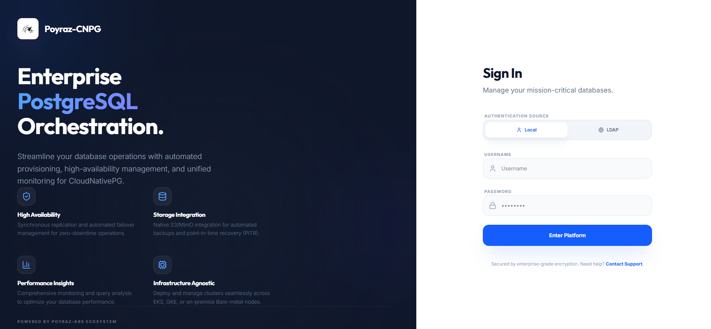
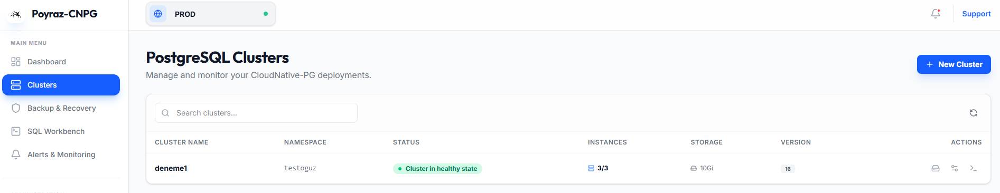
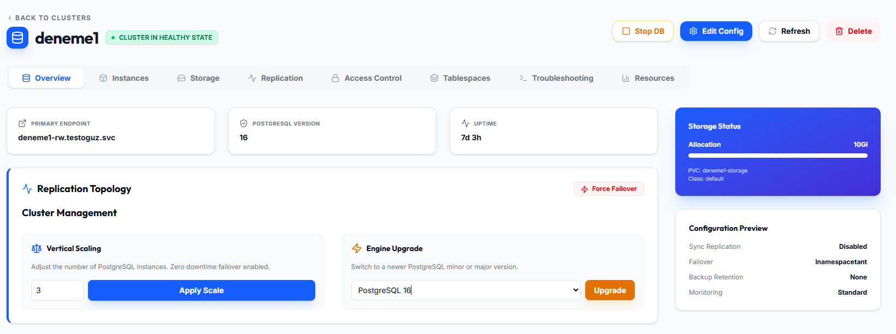
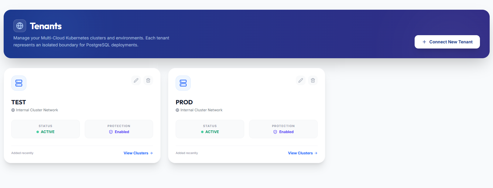
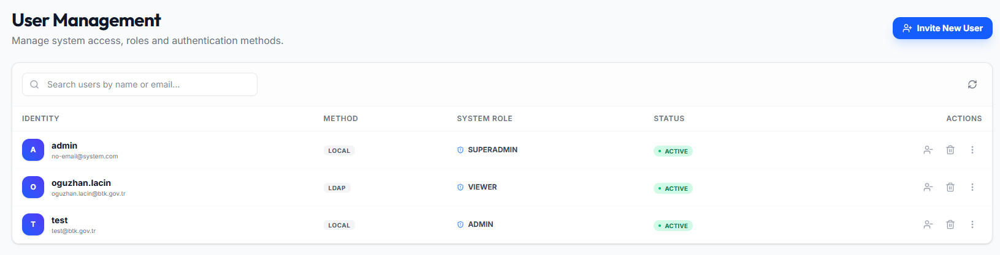
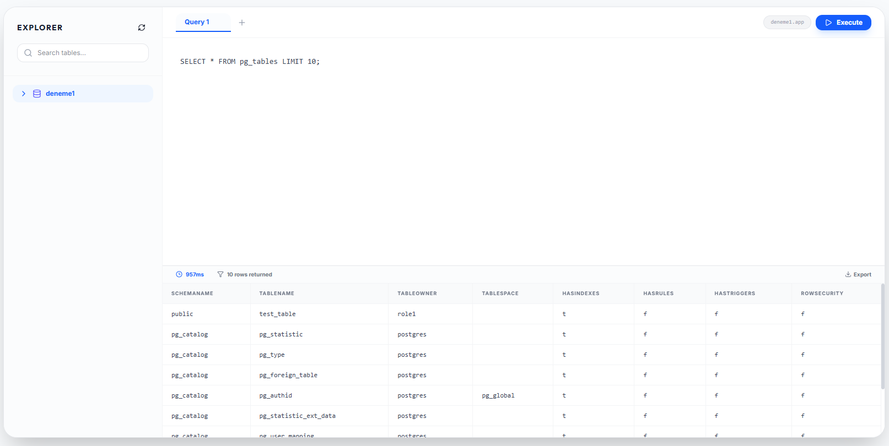
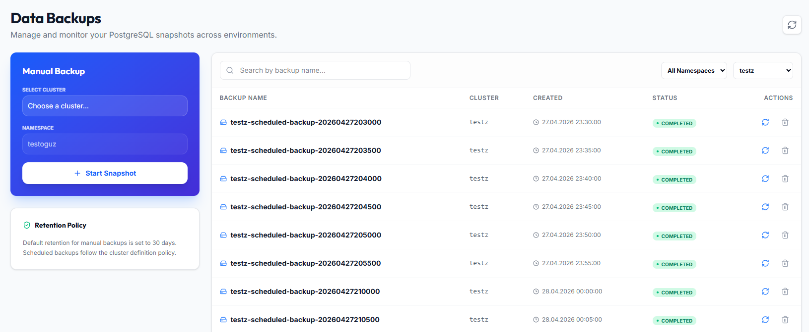
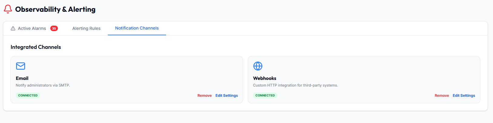

<p align="center">
  
</p>

<h1 align="center">Poyraz CNPG GUI</h1>

<p align="center">
  <strong>Poyraz Cnpg Gui - Postgresql Management UI</strong>
</p>

# CNPG — PostgreSQL Management UI

Lightweight, modern web UI for managing PostgreSQL clusters with a Spring Boot backend and Flyway migrations. Ready for local development and production Kubernetes deployments.

 

Key features
- Modern React + Vite frontend
- Spring Boot backend with Flyway migrations
- Docker Compose quickstart for local development
- Kubernetes manifests in `deploy/` for production

Contents
- Project overview
- Image build & push
- Kubernetes deployment
- Configuration
- Troubleshooting
- Screenshots
- Contributing

## Project overview
This repository contains a web-based administration UI and a Spring Boot backend for PostgreSQL management: tenants, users, backups/restores, audit logs and more. Database migrations are tracked under `src/main/resources/db/migration` via Flyway.


Access:
- Frontend: http://localhost:3000
- Backend API: http://localhost:8080

Note: Flyway migrations run automatically on backend startup.

## Quick İnstall
```bash
git clone https://github.com/capta1nBee/cnpg-gui.git
cd deploy
kubectl create namespace poyraz-system
kubectl apply -f configmap.yaml 
kubectl apply -f postgresql.yaml
kubectl apply -f backend.yaml
kubectl apply -f frontend.yaml
```

## Image build & push
Build and push backend image:

```bash
cd backend
docker build -t <registry>/cnpg-gui-backend:latest -f Dockerfile .
docker push <registry>/cnpg-gui-backend:latest
```

Build and push frontend image:

```bash
cd frontend
docker build -t <registry>/cnpg-gui-frontend:latest -f Dockerfile .
docker push <registry>/cnpg-gui-frontend:latest
```

Use semantic tags for releases (for example `v1.2.3`) and optionally update `latest`.

## Kubernetes — Production deployment
Manifest files are provided in `deploy/`: `backend.yaml`, `frontend.yaml`, `postgresql.yaml`.

Example deployment steps:

```bash
# namespace (optional)
kubectl create namespace poyraz-system || true

# create secrets/config and apply backend + frontend
kubectl apply -n poyraz-system -f deploy/configmap.yaml
`Change CORS_ALLOWED_ORIGINS --> cnpg.poyraz.com`


# apply Postgres
kubectl apply -n poyraz-system -f deploy/postgresql.yaml

# apply Frontend and Backend
kubectl apply -n poyraz-system -f deploy/backend.yaml
kubectl apply -n poyraz-system -f deploy/frontend.yaml
```

Adjust Ingress/LoadBalancer configuration in `deploy/*.yaml` for your environment and TLS settings.

To perform a rolling update after pushing a new image:

```bash
kubectl -n poyraz-system set image deploy/cnpg-gui-backend cnpg-gui-backend=<registry>/cnpg-gui-backend:v1.2.3
kubectl -n poyraz-system rollout status deploy/cnpg-gui-backend
```

## Configuration

Important variables:
- `DB_URL`, `DB_USER`, `DB_PASSWORD`
- `JWT_SECRET` , `JWT_EXPIRY_MS`
- `SUPERADMIN_USER`, `SUPERADMIN_PASSWORD`
- `CORS_ALLOWED_ORIGINS`

## Troubleshooting
- View backend logs: `kubectl -n poyraz-system logs deploy/cnpg-gui-backend`
- ImagePullBackOff: `kubectl  -n poyraz-system describe pod <pod>` and check image pull secrets
- Migration issues: verify DB permissions and Flyway migration scripts under `src/main/resources/db/migration`

## Screenshots
Overview of the UI (screenshots taken from `images/`):

- Dashboard
	
- Clusters
	
- Cluster details
	
- Tenants
	
- Users
	
- SQL Workbench
	
- Backups & Restore
	
- Alerts
	

## Contributing
- Fork and open a pull request.
- Coding standards: Java 17 for backend, Node.js 18+ for frontend.

---

If you'd like, I can also:
- produce a GitHub Actions CI workflow that builds and pushes images,
- create a Helm chart for parameterized deployments,
- or translate this README back into Turkish as well.

